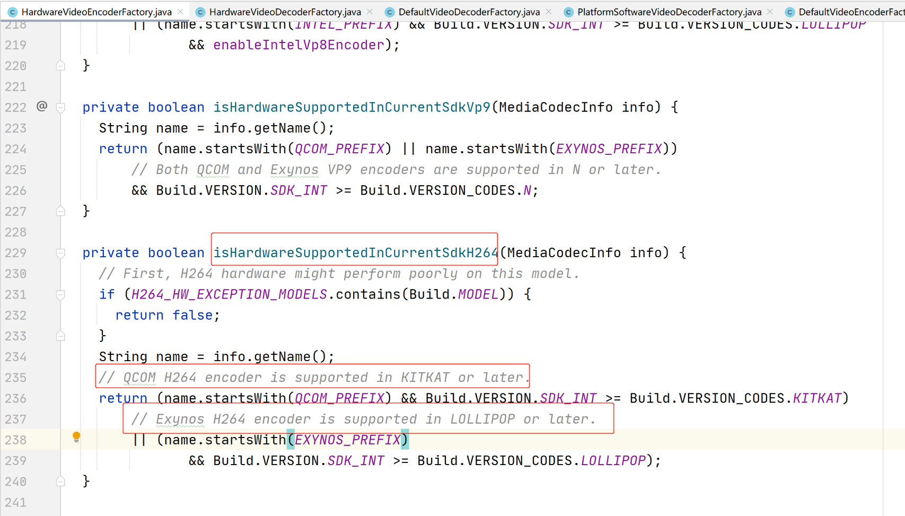
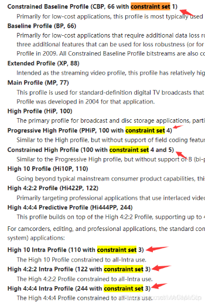
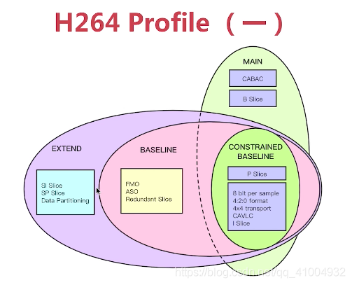
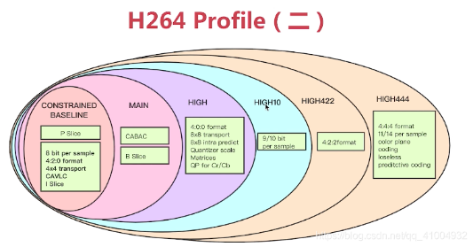
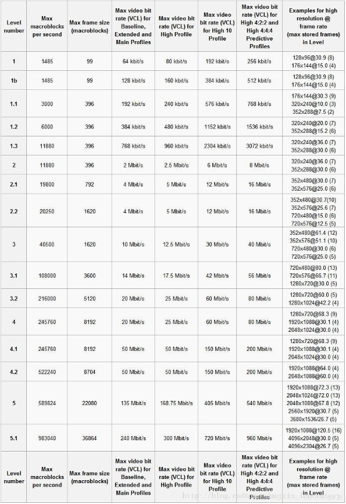
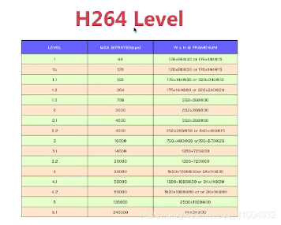
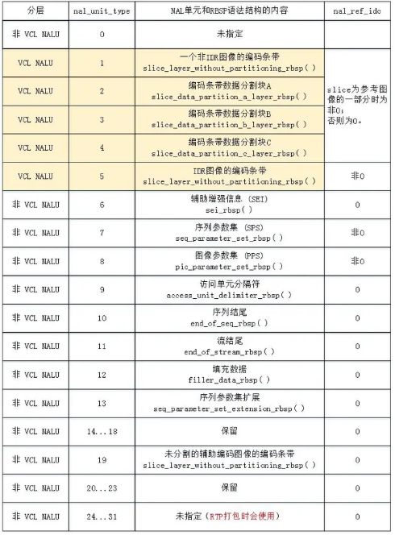
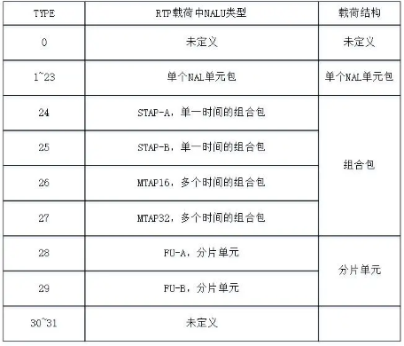

# mediasoup全端支持h264以及硬编硬解的方案


### fix bug
> 解决webrtc android sdk不支持华为麒麟手机h264硬件编码的bug
- 原因: webrtc android 硬件编码 google只承认高通和三星的264硬件编码。 如图

- 华为海思麒麟芯片的h264硬件编码器名称：OMX.hisi.video.encoder.avc
- 解决办法：
```
  private boolean isHardwareSupportedInCurrentSdkH264(MediaCodecInfo info) {
    // First, H264 hardware might perform poorly on this model.
    if (H264_HW_EXCEPTION_MODELS.contains(Build.MODEL)) {
      return false;
    }
    String name = info.getName();
    // QCOM H264 encoder is supported in KITKAT or later.
    return (name.startsWith(QCOM_PREFIX) && Build.VERSION.SDK_INT >= Build.VERSION_CODES.KITKAT)
        // Exynos H264 encoder is supported in LOLLIPOP or later.
        || (name.startsWith(EXYNOS_PREFIX)
               && Build.VERSION.SDK_INT >= Build.VERSION_CODES.LOLLIPOP)
        // Huawei hisi H264 encoder
        || (name.startsWith("OMX.hisi."));
  }
```
- 建议直接return true就得了，否则mtk ，rk等等芯片都得加。

### (一)怎么选择编码格式？这里暂时不考虑h265
1. webrtc默认支持：vp8，vp9，h264，h265，av1软编解码。
   - 在windows，linux：还默认软编软解。
   - 在Android平台：增加了支持vp8，vp9，h264的硬编硬解。平台还支持H265。
   - 在mac和ios平台：增加了支持h264的硬编硬解。平台还支持H265。
   - 在chorme浏览器：支持硬件加速。

**就因为ios和mac只支持h264的硬编硬解，就只能选择h264。**

### (二)h264的profile，level，打包模式
1. 支持全部5种profile。 其中kProfileBaseline优先：减少计算量和延迟。profile-level-id的计算方式如图：

    |profile|code|level|code|profile-level-id|
    |----|----|----|----|----|
    |kProfileBaseline           |4200|kLevel3_1(31)|1f|42001f|
    |kProfileConstrainedBaseline|42e0|kLevel3_1(31)|1f|42e01f|
    |kProfileMain               |4d00|kLevel3_1(31)|1f|4d001f|
    |kProfileHigh               |6400|kLevel4_1(41)|29|640029|
    |kProfileConstrainedHigh    |640c|kLevel4_1(41)|29|640c29|
2. 仅支持2两打包模式，"1"这种分片模式优先。[RFC文档](https://www.rfc-editor.org/rfc/pdfrfc/rfc6184.txt.pdf)
    - packetization-mode="1" //每个NALU分片，更适合udp
    - packetization-mode="0" //每个NALU一个rtp包，更适合tcp
    - [rtp h264打包参考文档1](https://www.likecs.com/show-204814195.html)
    - [rtp h264打包参考文档2](https://blog.csdn.net/qq_41681715/article/details/112389282)

### (三)mediasoup的codec协商
1. sfu：支持的codec来自config.js。需要手动列出来。
2. 客户端：支持的codec来自编解码工厂类。
3. 所有客户端：sfu和本地的codec交集发送到sfu记录下来。
4. producer：**在codec交集取第一个，或者手动指定一个，推流。**
5. sfu：转发给支持produer的codec的peer。
总结：推流的codec是sfu和客户端交集的第一个，或者动指定一个。 而sfu是否转发取决于交集里面包含与否。

### (三)sdpformat配置，在sfu和client配置所有的格式:10个Codec
1. sfu配置
    ```
    {
        kind       : 'video',
        mimeType   : 'video/h264',
        clockRate  : 90000,
        parameters :
        {
            'profile-level-id'        : '42e01f', //5个可选值
            'packetization-mode'      : 1,        //两可选值
            'level-asymmetry-allowed' : 1,
            'x-google-start-bitrate'  : 1000
        }
    }
    ```
 2. 客户端编解码工厂
    ```
    return {
          CreateH264Format(H264Profile::kProfileBaseline, H264Level::kLevel3_1,"1"),
          CreateH264Format(H264Profile::kProfileBaseline, H264Level::kLevel3_1,"0"),
          CreateH264Format(H264Profile::kProfileConstrainedBaseline,H264Level::kLevel3_1, "1"),
          CreateH264Format(H264Profile::kProfileConstrainedBaseline,H264Level::kLevel3_1, "0"),
          CreateH264Format(H264Profile::kProfileMain,H264Level::kLevel3_1, "1"),
          CreateH264Format(H264Profile::kProfileMain,H264Level::kLevel3_1, "0"),
          CreateH264Format(H264Profile::kProfileHigh,H264Level::kLevel4_1, "1"),
          CreateH264Format(H264Profile::kProfileHigh,H264Level::kLevel4_1, "0"),
          CreateH264Format(H264Profile::kProfileConstrainedHigh,H264Level::kLevel4_1, "1"),
          CreateH264Format(H264Profile::kProfileConstrainedHigh,H264Level::kLevel4_1, "0") };
    }
    ```
 ### (四)各端h264编码的实现
 1. pc,linux：编译自带的软便软解。 TODO：intel-mediasdk，nvidia-videosdk，dxva。
 2. ios/mac：RTCVideoDecoderFactoryH264/RTCVideoEncoderFactoryH264。
    - 只支持h264,**所以不用调顺序**。
    - 需要扩展sdpformat：编解码都默认只支持kProfileConstrainedHigh和kProfileConstrainedBaseline
    - 而且highprofile优先,是不是都已经硬件编码直接上high，没必要仅仅baseline了
 3. android：HardwareVideoEncoderFactory/HardwareVideoDecoderFactory：
    - 封装了mediacodec的vp8，vp9，h264。**需要调顺序用libmediaclient指定第一个h264**。
    - 需要扩展sdpformat：编解码都默认只支持kProfileConstrainedHigh和kProfileConstrainedBaseline。
    - 而且highprofile优先,是不是都已经硬件编码直接上high，没必要仅仅baseline了
 4. web: forceH264。浏览器支持哪些h64的codec格式呢？
 
 ### 参考
 
 
 
 
 
 
 