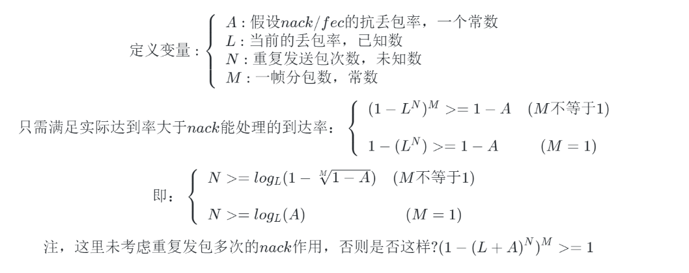
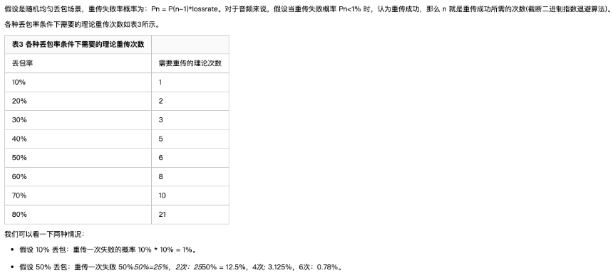

# 丢包率和重复发包次数的关系

### 一. 问题引出
- 在大量丢包情况，nack/fec可能不管用了，必须直接重复发送包，比如red包。
- 那么问题来了：在这种情况下，丢包率与重复发包数量的对应关系是什么呢？
- 忽略带宽限制和丢包不均匀情况

### 二. 例子与分析
>例子：假设现在丢包率是0.67，重复发三路，能不能抗住呢？答案是不能
1. 假设每个包丢掉的概率是0.67。
2. 重复发三路，三个都丢掉的概率是0.67 x 0.67 x 0.67=0.3；这个包没有丢的概率是1-0.3=0.7。
3. 完整一帧分M个包都没丢掉的概率0.7的M次方。
> 分析： 
1. 音频如果一帧一包，那包达到概率0.7。也就是三连发也抗不住0.67的丢包，还要丢0.3。
2. 每帧分包越多，丢包概率越大。
3. 0.7的M次方永远小于1；但如果nack/fec能抗一部分，就能解决问题。

### 三. 公式推导

```math
定义变量:
\left \{\begin{array}{l}
A: 假设nack/fec的抗丢包率，一个常数\\
L: 当前的丢包率，已知数\\
N: 重复发送包次数，未知数\\
M: 一帧分包数，常数\\
\end{array}\right. 

```

```math
只需满足实际达到率大于nack能处理的到达率：
\left \{\begin{array}{l}
 (1 - L^N)^M >= 1-A  & (M不等于1) \\\\
1- (L^N) >= 1-A      &  (M=1) 
\end{array}\right. 
```


```math
即：
\left \{\begin{array}{l}
N >= log_L(1 - \sqrt[M]{1-A})  & (M不等于1) \\\\
N >= log_L(A)                &  (M=1) 
\end{array}\right. 
```


```math
注，这里未考虑重复发包多次的nack作用，否则是否这样?
(1 - (L+A)^N)^M >= 1
```


## 四. 丢包率与重复的对应关系
对于音频取M=1或100，A=0.1, L分别取0.1，0.2，... 0.9

用一段js计算：
```
for (var i=1;i<10;i++)
{ 
    A     = 0.1
    L     = i*0.1
    M_1   = 1
    M_100 = 100.0
    N_1   = Math.log(A)                         /Math.log(L);
    N_100 = Math.log(1 - Math.pow(1-A, 1/M_100))/Math.log(L);
    console.log((L*100).toFixed(0)+"%", '|' ,Math.ceil(N_1) , '|', Math.ceil(N_100)); //向上取整
}
10% | 1 | 3
20% | 2 | 5
30% | 2 | 6
40% | 3 | 8
50% | 4 | 10
60% | 5 | 14
70% | 7 | 20
80% | 11 | 31
90% | 22 | 66
```

丢包率 | 音频重复发包次数(M=1) | 视频重复发包次数(M=100) 
---|---|---
10% | 1 | 3
20% | 2 | 5
30% | 2 | 6
40% | 3 | 8
50% | 4 | 10
60% | 5 | 14
70% | 7 | 20
80% | 11 | 31
90% | 22 | 66

### 五. 兴趣
