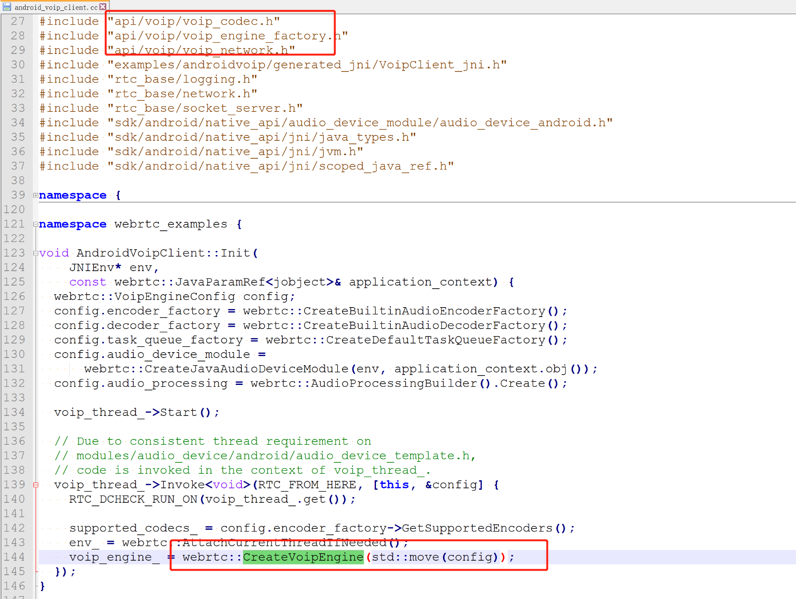
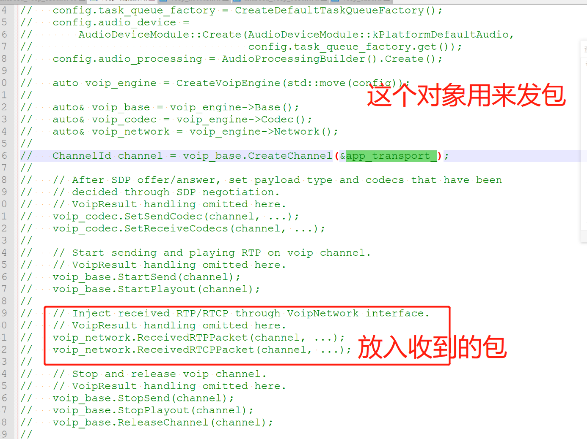
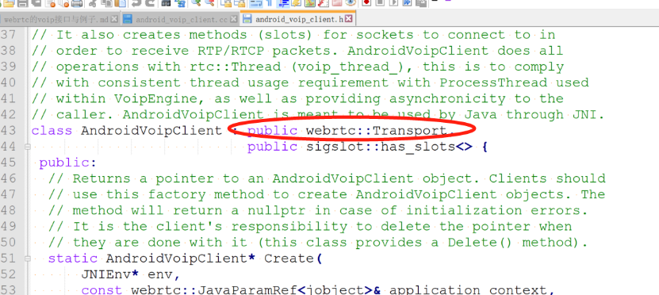
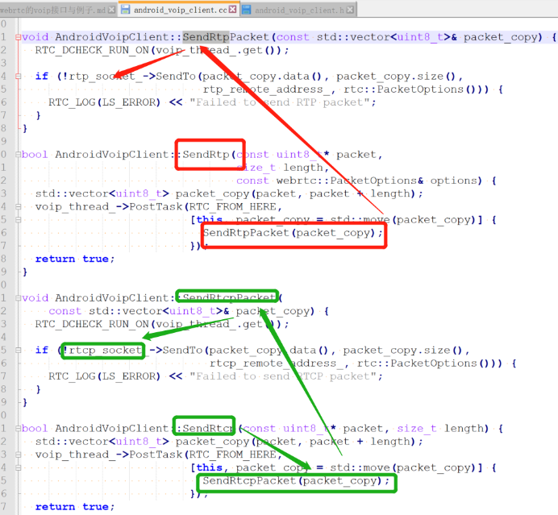

# 简单学习webrtc的voip接口

### 一. 简单总结
1. voip：网络电话，也就是语音通话。常常使用sip协议。
2. webrtc的voip接口：提供纯语音通讯配置与控制接口，但是**传输需要用户自己做**。
3. voip内部只用到音频相关模块(音频采集播放编码等) 和 rtp-rtcp包处理模块。
4. 它没有peerconneciton，没有sdp，没有sdp协商，没有p2p，没有ice，没call，也就没带宽估计。
5. 意义：它的优点是代码结构很简单轻量，除了可以实现voip，也是学习webrtc源码的一个入口点和突破口。

### 二. 直接看例子
- 代码目录：webrtc\src\examples\androidvoip
- 例子实现tcp的rtp传输，输入对方ip和端口就行

## 二. voip的接口与收发包
> 创建channel时设置：发送rtp包的传输对象
> 用network接口：注入收到的rtp包
> voip内部的rtp包和rtcp包准好了,就要调传入的webrtc::trasnport也就是this发送
> rtp包最终用rtp_socket发送
> rtcp包最用用rtcp_socket发送

### 三. voip内部组件
> 内部实现只用到了较少的webrtc组件，比较简单

